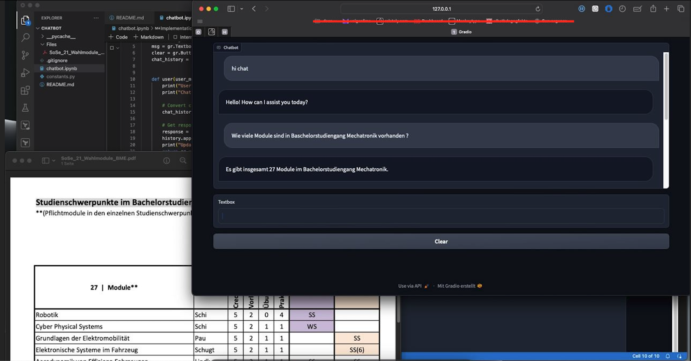

# Deployment of Chatbot Web-App. 
## Bullet points:
- Creat Open AI account 
- Generate API Key
- Implement of loading proccess the local data with langChain
- Chunk the data using a text splitter and creation of embeddings
- Implement UI for  Web-App with Gradio

Exaple of how it can looks like:
